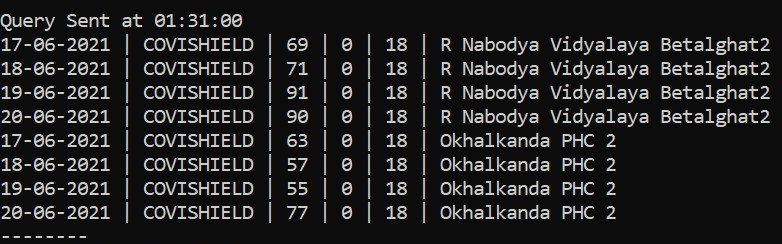
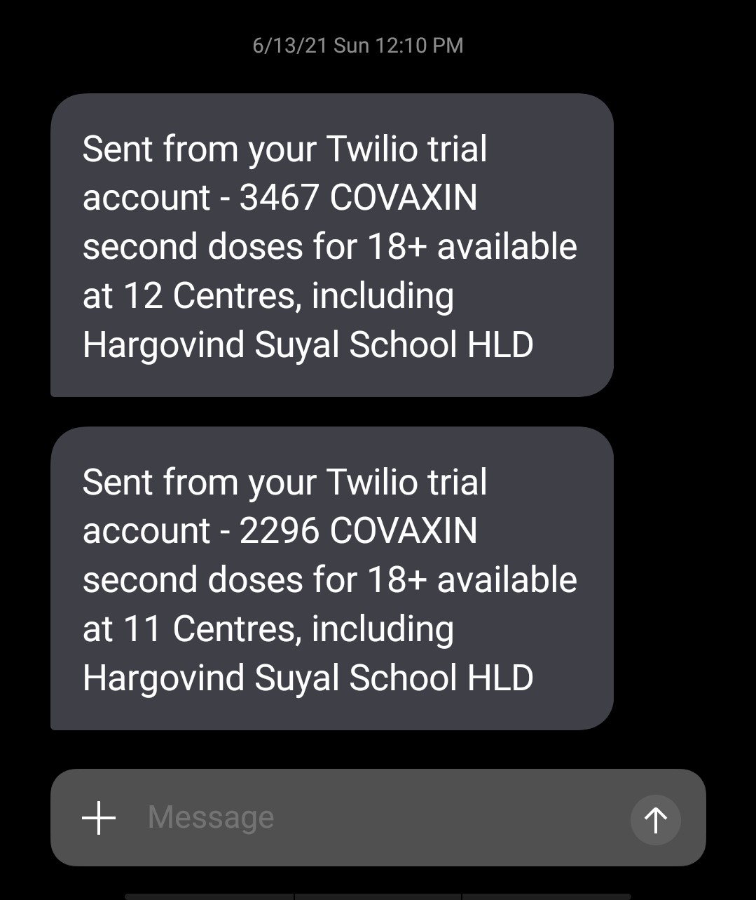
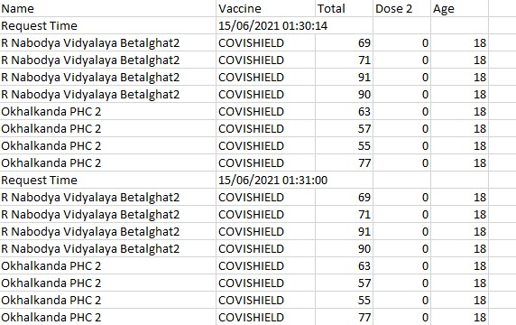

<h1>My Cowin API Script</h1>

As the date for my second dose of vaccination came closer, I faced two problems while trying to find a slot : 

<ul>
<li>
I had no information on when the slots are updated.</li>
<li>Slots for the vaccine get booked almost instantaneously.</li> 
</ul>

As I am learning python and I was aware of the Cowin API. I decided to write a program that would solve these problems.

This is a python script I made that stores vaccine slot data in a csv and sends me SMS alerts when solts for the vaccine I want are available. It makes use of the Cowin API for information on slots and Twilio for SMS alerts.The script is hard coded for my need i.e it will send out an alert only when COVAXIN Dose 2 for 18+ is available in my district or the neighbouring one.

 If you want to use this for yourself and you are familiar with python:

<ul>
<li>
use pip to install any modules you are missing
</li>
<li>
Create a twilio account and add your account SID,auth token, Twilio number and your phone number</li>
<li>Change the parameters of the get requests, to get your district ID follow <a href="https://pypi.org/project/cowin/">https://pypi.org/project/cowin/</a></li>
<li>Change the if statements as per your needs</li>

</ul>

If you aren't familiar with python, I would recommend other <a href="https://cowinalert.com">web based applications</a>, <a href="https://under45.in">telegram bots</a> or <a href="https://play.google.com/store/apps/details?id=com.healthifyme.basic&pid=Website_CTA">apps</a> that are just as efficient and are simpler to setup.

